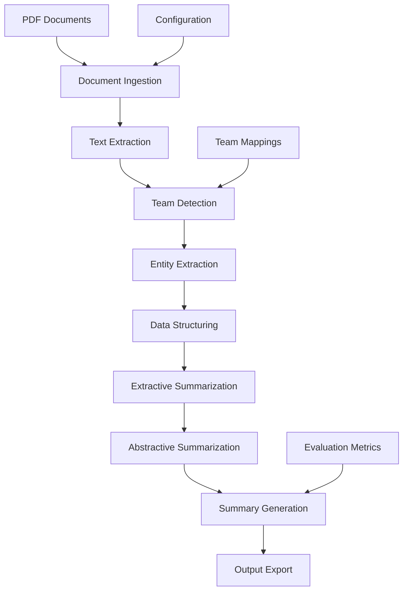

# F1 Infringement Analysis: Multi-Team NLP Summarization Project

## Product Requirements Document (PRD)

**Project:** Building Infringement Profiles for Formula One Teams  
**Domain:** Natural Language Processing & Sports Analytics  

---

## 1. Executive Summary

### 1.1 Project Overview
This project extracts and analyzes Formula One (F1) stewards' decision reports spanning 2020-2024 to build comprehensive infringement profiles for all F1 teams. Using advanced NLP techniques including extractive and abstractive summarization, we aim to discover penalty patterns, regulatory trends, and team behavioral insights through automated text analysis.

### 1.2 Business Objectives
- **Primary Goal:** Generate unbiased, factual summaries of team infringement patterns across multiple seasons
- **Secondary Goal:** Create a reproducible pipeline for ongoing F1 regulatory analysis
- **Research Impact:** Contribute to motorsport analytics through transparent, data-driven insights

### 1.3 Success Metrics
- **Coverage:** Analyze 900+ FIA decision documents across 10 teams, 5 seasons
- **Accuracy:** >90% entity extraction precision for key fields
- **Quality:** ROUGE-L score >0.6 for generated summaries
- **Reproducibility:** 100% open-source code and transparent methodology

---

## 2. Problem Statement

### 2.1 Current State
- FIA decision documents exist in unstructured PDF format
- Manual analysis of infringement patterns is time-intensive
- No systematic approach to compare team behaviors across seasons
- Limited accessibility to regulatory trend analysis

### 2.2 Pain Points
- **Unstructured Data:** PDFs contain inconsistent formatting across years/races
- **Scale Challenge:** 900+ documents require automated processing
- **Pattern Recognition:** Manual identification of trends is error-prone
- **Comparative Analysis:** Difficult to compare teams across different time periods

### 2.3 Opportunity
Create an automated system that transforms unstructured FIA documents into structured, summarized insights for comprehensive team behavior analysis.

---

## 3. Product Requirements

### 3.1 Functional Requirements

#### 3.1.1 Data Collection & Processing
- **FR-001:** Extract text from PDF documents using PyPDF2/pdfminer
- **FR-002:** Identify and categorize documents by team affiliation
- **FR-003:** Extract metadata (date, race, session, document number)
- **FR-004:** Handle multi-year data (2020-2024) with version compatibility

#### 3.1.2 Team Detection & Classification
- **FR-005:** Detect all 10 F1 teams using pattern matching
- **FR-006:** Map car numbers to drivers for each season
- **FR-007:** Handle team name variations and aliases
- **FR-008:** Support driver changes across seasons

#### 3.1.3 Entity Extraction
- **FR-009:** Extract driver names, car numbers, team names
- **FR-010:** Identify infringement types and categories
- **FR-011:** Extract penalties and decisions
- **FR-012:** Parse steward reasoning and justifications

#### 3.1.4 Text Processing Pipeline
- **FR-013:** Clean and normalize extracted text
- **FR-014:** Segment documents into logical components
- **FR-015:** Handle multilingual content and special characters
- **FR-016:** Remove boilerplate and non-informative content

#### 3.1.5 Summarization Engine
- **FR-017:** Apply extractive summarization (LexRank/TextRank)
- **FR-018:** Implement abstractive summarization (BART/T5/PEGASUS)
- **FR-019:** Generate 3-5 line summaries per team per year
- **FR-020:** Ensure factual consistency in summaries

#### 3.1.6 Output Generation
- **FR-021:** Create structured CSV outputs
- **FR-022:** Generate team-year summary reports
- **FR-023:** Produce visualization-ready datasets
- **FR-024:** Export results in multiple formats (JSON, CSV, TXT)

### 3.2 Non-Functional Requirements

#### 3.2.1 Performance
- **NFR-001:** Process 900+ documents within 2 hours
- **NFR-002:** Memory usage <8GB during processing
- **NFR-003:** Support concurrent processing of multiple teams

#### 3.2.2 Quality
- **NFR-004:** >90% precision for entity extraction
- **NFR-005:** >85% recall for team identification
- **NFR-006:** ROUGE-L score >0.6 for summaries
- **NFR-007:** <5% factual inconsistencies in outputs

#### 3.2.3 Reliability
- **NFR-008:** Handle corrupted or unreadable PDFs gracefully
- **NFR-009:** Provide detailed error logging and reporting
- **NFR-010:** Support resume functionality for interrupted processing

#### 3.2.4 Usability
- **NFR-011:** Command-line interface for easy execution
- **NFR-012:** Jupyter notebook for interactive development
- **NFR-013:** Clear documentation and usage examples
- **NFR-014:** Modular design for easy customization

---

## 4. Technical Architecture

### 4.1 System Components



### 4.2 Technology Stack

#### 4.2.1 Core Libraries
- **PDF Processing:** PyPDF2, pdfminer.six
- **NLP:** spaCy, NLTK, transformers
- **Summarization:** LexRank, TextRank, BART, T5
- **Data Processing:** pandas, numpy
- **Evaluation:** rouge-score, bert-score

#### 4.2.2 Development Environment
- **Language:** Python 3.8+
- **Notebook:** Jupyter Lab
- **Version Control:** Git
- **Documentation:** Markdown, Sphinx

### 4.3 Data Flow

1. **Input:** PDF documents from FIA website
2. **Processing:** Text extraction and team classification
3. **Analysis:** Entity extraction and summarization
4. **Output:** Structured summaries and insights

---

## 5. Implementation Plan

### 5.1 Phase 1: Foundation (Weeks 1-2)
- Set up development environment
- Implement basic PDF text extraction
- Create team detection patterns
- Build initial data pipeline

### 5.2 Phase 2: Core Processing (Weeks 3-4)
- Expand team detection to all 10 teams
- Implement entity extraction pipeline
- Create structured data output format
- Add error handling and logging

### 5.3 Phase 3: Summarization (Weeks 5-6)
- Implement extractive summarization
- Add abstractive summarization models
- Create team-year grouping logic
- Generate initial summaries

### 5.4 Phase 4: Optimization (Weeks 7-8)
- Optimize performance and memory usage
- Improve summarization quality
- Add evaluation metrics
- Create visualization outputs

### 5.5 Phase 5: Documentation (Weeks 9-10)
- Complete code documentation
- Create user guides and examples
- Prepare evaluation reports
- Package for distribution

---

## 6. Data Specifications

### 6.1 Input Data
- **Source:** FIA official decision documents
- **Format:** PDF files
- **Coverage:** 2020-2024 seasons
- **Volume:** ~900 documents
- **Teams:** 10 F1 teams
- **Languages:** English (primary)

### 6.2 Output Data

#### 6.2.1 Structured Records
```csv
team,driver,car_number,year,race,infraction_type,penalty,decision,steward_reason
```

#### 6.2.2 Team-Year Summaries
```json
{
  "team": "Mercedes-AMG Petronas F1",
  "year": "2020",
  "summary": [
    "Key insight 1",
    "Key insight 2",
    "Key insight 3"
  ]
}
```

### 6.3 Data Quality Standards
- **Completeness:** >95% of documents processed
- **Accuracy:** <5% entity extraction errors
- **Consistency:** Standardized team/driver names
- **Timeliness:** Process within 24 hours of data availability

---

## 7. Evaluation Framework

### 7.1 Extraction Quality Metrics
- **Precision:** Correctly extracted entities / Total extracted entities
- **Recall:** Correctly extracted entities / Total available entities
- **F1-Score:** Harmonic mean of precision and recall

### 7.2 Summarization Quality Metrics
- **ROUGE Scores:** ROUGE-1, ROUGE-2, ROUGE-L
- **BLEU Score:** BLEU-4 for translation quality
- **Key-Entity Overlap:** Percentage of important facts retained
- **Compression Ratio:** Summary length / Source length

### 7.3 Consistency Metrics
- **SummaC Score:** Factual consistency assessment
- **FactCC Classification:** Supported vs. unsupported claims
- **Redundancy Check:** Duplicate phrase identification

### 7.4 Evaluation Dataset
- **Size:** 100 manually annotated documents
- **Coverage:** All teams and years represented
- **Annotation:** Expert F1 domain knowledge
- **Validation:** Inter-annotator agreement >0.8

---

## 8. Risk Assessment

### 8.1 Technical Risks
- **PDF Parsing Errors:** Inconsistent document formats
- **Mitigation:** Multiple parsing libraries and fallback methods

- **Model Performance:** Low summarization quality
- **Mitigation:** Multiple model comparison and fine-tuning

- **Scalability Issues:** Memory/time constraints
- **Mitigation:** Batch processing and optimization

### 8.2 Data Risks
- **Missing Documents:** Incomplete dataset
- **Mitigation:** Comprehensive source verification

- **Format Changes:** FIA document structure evolution
- **Mitigation:** Flexible parsing patterns and version handling

### 8.3 Project Risks
- **Timeline Delays:** Complex implementation challenges
- **Mitigation:** Agile development with regular milestones

- **Quality Issues:** Insufficient evaluation metrics
- **Mitigation:** Early validation and iterative improvement

---

## 9. Success Criteria

### 9.1 Technical Success
- ✅ Process all 900+ documents successfully
- ✅ Achieve >90% entity extraction accuracy
- ✅ Generate coherent 3-5 line summaries
- ✅ Complete pipeline runs in <2 hours

### 9.2 Research Success
- ✅ Identify meaningful infringement patterns
- ✅ Provide actionable insights for F1 analytics
- ✅ Demonstrate reproducible methodology
- ✅ Contribute to motorsport research community

### 9.3 Impact Success
- ✅ Enable data-driven regulatory analysis
- ✅ Support fair competition through transparency
- ✅ Create valuable resource for F1 stakeholders
- ✅ Establish foundation for future research

---

## 10. Deliverables

### 10.1 Code Deliverables
- Complete Python codebase with documentation
- Jupyter notebooks for interactive development
- Configuration files and setup scripts
- Unit tests and validation scripts

### 10.2 Data Deliverables
- Structured CSV files with extracted entities
- Team-year summary reports in JSON format
- Evaluation datasets and metrics
- Visualization-ready datasets

### 10.3 Documentation Deliverables
- Technical documentation and API reference
- User guide and usage examples
- Research methodology paper
- Evaluation results and analysis

### 10.4 Research Deliverables
- Comprehensive infringement pattern analysis
- Team behavior insights and trends
- Regulatory evolution documentation
- Recommendations for future research

---

## 11. Ethics and Compliance

### 11.1 Data Privacy
- All data sourced from publicly available FIA documents
- No personal information collection beyond public records
- Compliance with data protection regulations

### 11.2 Bias and Fairness
- Objective analysis focused on factual accuracy
- Avoid subjective interpretations or reputational judgments
- Transparent methodology to ensure reproducibility

### 11.3 Open Source Commitment
- Complete codebase available under open source license
- Transparent methodology and evaluation metrics
- Community contribution and feedback welcome

---

## 12. Future Enhancements

### 12.1 Short-term (3-6 months)
- Real-time processing of new documents
- Enhanced visualization dashboards
- API development for external access

### 12.2 Medium-term (6-12 months)
- Integration with other F1 data sources
- Machine learning model improvements
- Mobile application development

### 12.3 Long-term (1-2 years)
- Multi-language support for international analysis
- Predictive modeling for infringement patterns
- Integration with FIA official systems

---

## 13. Conclusion

This PRD outlines a comprehensive approach to building infringement profiles for Formula One teams through advanced NLP techniques. The project aims to transform unstructured FIA documents into valuable insights while maintaining the highest standards of accuracy, transparency, and reproducibility.

The proposed system will not only provide immediate value for F1 analytics but also establish a foundation for ongoing regulatory analysis and research in motorsport data science.

---

**Document Status:** Draft  
**Next Review:** Weekly during development  
**Approval Required:** Project stakeholders  
**Distribution:** Development team, research collaborators